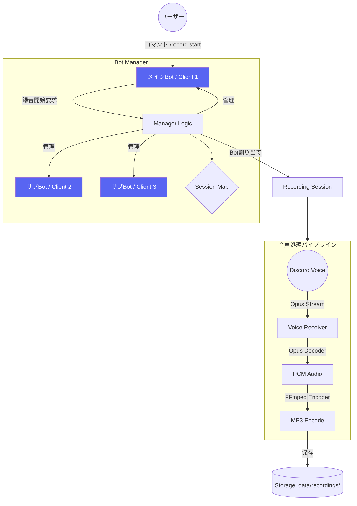

# Discord Multi-Bot Voice Recorder

複数のDiscord Botを使用して、同一サーバー内の複数のボイスチャンネルを同時に録音し、MP3形式で保存するツールです。

## 主要機能

- **マルチBot対応**: 最大3つのBot（設定により増減可能）を管理し、複数のチャンネルで同時に録音が可能。
- **自動割り当て**: 空いているBotを自動的に検出し、録音セッションに割り当てます。
- **MP3形式保存**: DiscordのOpus音声をリアルタイムでデコードし、FFmpegを使用してMP3形式で保存します。
- **Docker対応**: Docker環境で簡単にデプロイ・実行が可能です。

## アーキテクチャ構成



## セットアップ

### 1. Botの準備
1. [Discord Developer Portal](https://discord.com/developers/applications)で最大3つのBot（または必要な数）を作成します。
2. 以下の設定を有効にしてください：
   - **Privileged Gateway Intents**: `GUILD_MESSAGES`, `MESSAGE_CONTENT`, `GUILD_VOICE_STATES`
3. 各Botをサーバーに招待してください（権限：`Bot`,`applications.commands`,`View Channels`, `Connect`, `Speak`, `Send Messages`）。

### 2. 環境設定
`.env.example` をコピーして `.env` を作成し、各Botのトークンを記入します。

```bash
cp .env.example .env
```

`.env` の内容:
```env
DISCORD_TOKEN_1=your_first_bot_token
DISCORD_TOKEN_2=your_second_bot_token
DISCORD_TOKEN_3=your_third_bot_token
GUOLD_ID==your_server_ID
```

### 3. Dockerで起動
以下のコマンドを実行して起動します。

```bash
docker compose up -d --build
```

## 使い方

メインBot（`DISCORD_TOKEN_1`）に対してメッセージを送信します。

- **録音開始**: `/record start`
  - コマンドを実行したユーザーが参加しているボイスチャンネルの録音を開始します。
- **録音停止**: `/record stop`
  - 録音を停止し、ファイルを保存します。

保存されたファイルは `data/recordings/[セッションID]/[ユーザーID].mp3` に出力されます。

## 技術スタック

- **Runtime**: Node.js 22 (TypeScript)
- **Library**: discord.js, @discordjs/voice
- **Audio Processing**: prism-media, FFmpeg
- **Container**: Docker
