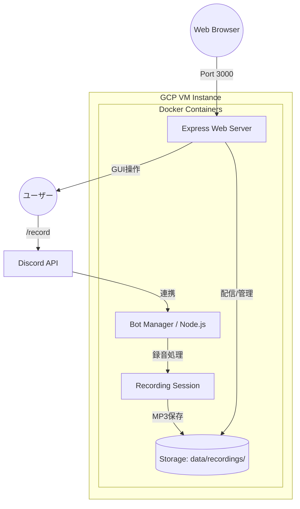

# Discord Voice Recorder with Web Gallery

GCP (Google Cloud Platform) 上で動作し、Discord の通話内容を録音・管理できるシステムです。
複数の Bot を使用した同時録音や、ブラウザからの再生・ダウンロード・削除に対応しています。

## 主要機能

- **Web ギャラリー (GUI)**: 録音したファイルをブラウザで一覧表示、再生、ダウンロード、および削除が可能。
- **データローテーション (自動削除)**: 指定した日数（デフォルト7日）が経過した古い録音を自動でクリーンアップし、ディスク容量を節約。
- **グローバルスラッシュコマンド**: `/record start`, `/record stop` で簡単に録音をコントロール。
- **マルチ Bot 対応**: 最大3つの Bot を管理し、複数のボイスチャンネルを同時に録音可能。
- **Docker 運用**: GCP VM (e2-micro 等) 上の Docker 環境で安定して動作。

## アーキテクチャ構成


```mermaid
graph TD
    User((ユーザー)) -->|/record| Discord[Discord API]
    Discord -->|連携| BotManager[Bot Manager / Node.js]
    
    subgraph VM [GCP VM Instance]
        subgraph Docker [Docker Containers]
            BotManager -->|録音処理| RecSession[Recording Session]
            RecSession -->|MP3保存| Storage[(Storage: data/recordings/)]
            WebServer[Express Web Server] -->|配信/管理| Storage
        end
    end
    
    Gallery((Web Browser)) -->|Port 3000| WebServer
    WebServer -->|GUI操作| User
```

## セットアップ (GCP VM 向け)

### 1. 準備物
- **GCP インスタンス**: e2-micro (OS: Debian/Ubuntu 推奨), ディスク 30GB (Free Tier 範囲内)。
- **Discord Bot トークン**: 複数チャンネルを同時録音したい場合は最大3つ用意。
  - **Intents**: `GUILD_MESSAGES`, `MESSAGE_CONTENT`, `GUILD_VOICE_STATES` を有効化。

### 2. インストール
VM 上で以下のコマンドを実行します。

```bash
git clone https://github.com/suzukigame/discord-recorder.git
cd discord-recorder
cp .env.example .env
# .env を編集してトークンを記入
```

### 3. 設定 (.env)
```env
DISCORD_TOKEN_1=your_token_1
DISCORD_TOKEN_2=your_token_2
DISCORD_TOKEN_3=your_token_3
RETENTION_DAYS=7  # 何日分保持するか
TZ=Asia/Tokyo
```

### 4. 起動
```bash
docker compose up -d --build
```

## 使い方

### 録音操作 (Discord)
- **録音開始**: `/record start`
  - 実行したユーザーがいるボイスチャンネルを録音開始。
- **録音停止**: `/record stop`
  - 録音を終了し、ミックスされた MP3 をウェブギャラリーへ公開。

### 管理操作 (Web GUI)
ブラウザで `http://[VMの外部IP]:3000/` にアクセスします。
- **再生/ダウンロード**: リストから対象の録音を確認できます。
- **削除**: 不要な録音は右側の「削除」ボタンから手動で消去可能です。

## 技術スタック
- **Runtime**: Node.js 22 (TypeScript)
- **Web**: Express, Vanilla JS / CSS (Glassmorphism design)
- **Audio**: @discordjs/voice, ffmpeg-static
- **Deployment**: GCP, Docker Compose
