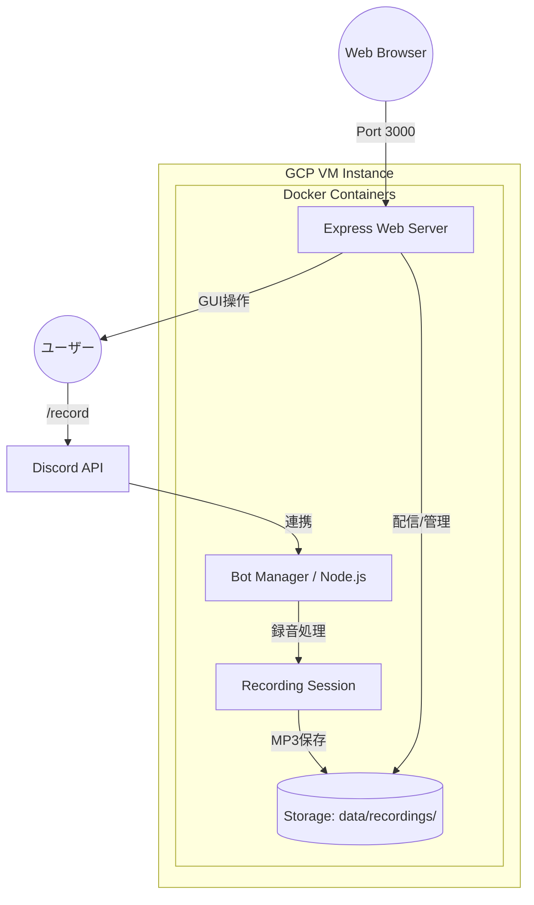

# システムアーキテクチャ構成

このドキュメントでは、Discord Voice Recorder の技術的な構成について説明します。

## 全体構成図

## コンポーネント詳細

### 1. Bot Manager (Node.js)
- 複数の Discord Client (Bot) を一括管理。
- スラッシュコマンドのリクエストを受け取り、空いている Bot をボイスチャンネルへ派遣。
- セッションのライフサイクル（開始・停止）を制御。

### 2. Recording Session
- ユーザーごとの音声ストリームを非同期で受信。
- `prism-media` を使用して Opus デコードを行い、PCM データへ変換。
- ギャップ埋め（無音補完）ロジックにより、パケットロスがあっても音ズレを防ぐ。
- セッション終了時に `ffmpeg` を使用して全ユーザーの音声をミックスし、MP3 を生成。

### 3. Web Server (Express)
- `data/recordings` フォルダ内の MP3 ファイルをスキャン。
- 静的ファイル配信およびファイル情報の JSON API を提供。
- 手動削除（DELETE API）を処理。

### 4. 運用・保守
- **Docker**: すべての環境をコンテナ化し、GCP VM 上で一貫した動作を保証。
- **データローテーション**: `BotManager` 起動時および 24 時間おきに古いファイルを自動削除。
